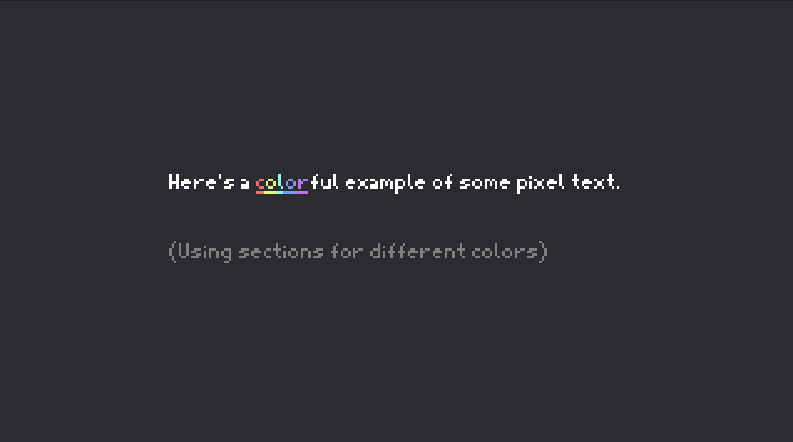

# Bevy Pxtxt

Call it what you want — "pixel font," "image font," "texture font," etc. Either way, this library has it. `bevy_pxtxt` allows users to create fonts and render text based on images they draw themself.

The images by default are `.png` files, but `.bmp`, `.jpeg`, `.gif`, or `.tiff` can be used with their corresponding feature flags.

## Example

`assets/moonshock.ron`

```ron
(
    name: "Moonshock",
    image: "moonshock.png",
    glyph_width: Varied (
        max: 5,
        min: 1,
    ),
    spacing: 1,
    ascender: 7,
    descender: 2,
)
```

`examples/sections.rs`

```rust
use bevy::prelude::*;
use bevy_asset_loader::asset_collection::{AssetCollection, AssetCollectionApp};
use bevy_pxtxt::{plugin::PxtxtPlugin, pxfont::PxFont, pxtext::{PxText, PxTextBundle, PxTextSection}};

#[derive(AssetCollection, Resource)]
struct PxFontCollection {
    #[asset(path = "moonshock.ron")]
    pub moonshock: Handle<PxFont>,
}

fn main() {
    App::new()
        .add_plugins((DefaultPlugins, PxtxtPlugin::default()))
        .init_collection::<PxFontCollection>()
        .insert_resource(Msaa::Off)
        .add_systems(Startup, setup)
        .run();
}

fn setup(
    fonts: Res<PxFontCollection>,
    mut commands: Commands,
) {
    commands.spawn(Camera2dBundle::default());
    commands.spawn(PxTextBundle {
        text: PxText::from_sections(
            vec![
                PxTextSection::new("Here's a ")
                    .with_color(Color::WHITE),
                PxTextSection::new("c")
                    .with_color(Color::hsl(0., 0.9, 0.7)).underlined(),
                PxTextSection::new("o")
                    .with_color(Color::hsl(70., 0.9, 0.7)).underlined(),
                PxTextSection::new("l")
                    .with_color(Color::hsl(170., 0.9, 0.7)).underlined(),
                PxTextSection::new("o")
                    .with_color(Color::hsl(220., 0.9, 0.7)).underlined(),
                PxTextSection::new("r")
                    .with_color(Color::hsl(280., 0.9, 0.7)).underlined(),
                PxTextSection::new("ful example of some pixel text.\n\n")
                    .with_color(Color::WHITE),
                PxTextSection::new("(Using sections for different colors)")
                    .with_color(Color::GRAY),
            ], fonts.moonshock.clone()
        ).with_line_spacing(5),
        transform: Transform::from_scale(Vec3::splat(4.0)),
        ..Default::default()
    });
}
```

Result:


## `PxFontData` Files

Fonts are loaded onto `PxFont`s, which uses `PxFontData` for deserialization. This is the struct that the `.ron` files write.

**Required Fields**:
- `name` - the name of the font
- `image` - the path to the image of the font, relative to the `assets` folder
- `glyph_width` - width of each character
    - `Varied` - automatically detect the width of characters between a `max` and `min` value
    - `Monospace` - all characters are the same width
- `ascender` - number of pixels above the base line
- `descender` - number of pixels below the base line

**Optional Fields**:
- `char_layout` - what characters are displayed on the image
    - `StartingAt` - the characters start at the given character and continue in order of ascending unicode value
    - `Ranges` - the characters are given as a series of ranges
    - `Listed` - the characters are individually listed
    - default: `StartingAt(' ')`
- `spacing` - space between each character within a word
    - default: `1`
- `padding` - padding between characters in the image
    - default: `(0, 0)`

## Input

Sections with can receive events for **left clicks**, **right clicks**, and **hovering**. `PickableText` senses these events, when the child of an entity with `PxText`.

To receive these events, use `EventReader<PxTextEvent>` ([read up on events](https://bevy-cheatbook.github.io/programming/events.html)).

## Examples

See `examples/bounded.rs` for how bounding boxes can be used.

See `examples/picking.rs` for how input can be used.

See `examples/sections.rs` (above as well) for how different sections can be used.

## Compatibility

Bevy Pxtxt version `0.1` is comptabile with Bevy version `0.13`.

## License

This library, including the examples and assets, is licensed under the [MIT License](LICENSE).
